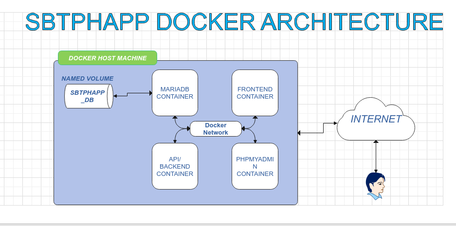

# SBTPHAPP-DEVOPS-PROJECT

In this branch we will rebuild our sbtphapp project using **docker**.
Docker is a platform and a set of tools designed to simplify the creation, deployment, and scaling of applications using containerization. Containers are lightweight, standalone, and executable software packages that include everything needed to run a piece of software, including the code, runtime, libraries, and system tools. **Docker** provides a standardized way to package and distribute applications, ensuring that they run consistently across different environments.**Docker** nplays a crucial role in our DevOps journey as a transformative technology. To enhance our understanding, we will embark on a hands-on exploration of Docker by containerizing our sbtphapp project. This practical experience will empower us to leverage Docker's capabilities in simplifying application deployment, ensuring consistency across environments, and streamlining our development and operational processes.
In the previous "lift-and-shift" branch, we built the following architecture:


## Prerequisites:
  - Host machine preferabbly Ubuntu 20.04 Server with atleast **4GB of memory**. You can setup Server in Digital Ocean which they called as Droplet. They 200$ dollar free for 2months 
  - Docker must be installed on that machine. For docker installation in Ubuntu 20.04 Server, here's the link https://docs.docker.com/engine/install/ubuntu/
  


## Architecture Overview: 




## Setup Instructions:

1. Clone Project Repository:<br />

   ```bash
        git clone -b docker  https://github.com/robudexIT/sbtphapp-project-devops.git
   ```
2. GET YOUR HOSTMACHINE IP ADDRESS. 

3. cd to sbtphapp-project-devops/docker/frontend and run the command below.(Dont forget to change YOURMACHINE_PUBLIC_IP_HERE to your actual IP Address )

   ```bash
      find dist/js/* -type f -exec sed -E -i 's/\b([0-9]{1,3}\.){3}[0-9]{1,3}:8081\b/YOURMACHINE_PUBLIC_IP_HERE:8081/g' {} +
   ```
4. cd back to sbtphapp-project-devops/docker and run the command below.
   This command is used to build Docker images defined in a docker-compose.yml file. Here's a breakdown of the command:

   ```bash
      docker compose build  
   ```
5. After the docker finished run the command below. This command is used to start Docker containers defined in a docker-compose.yml file in detached mode. Let's break down the command:
  
  ```bash
     docker compose up -d
  ```
6. run the command below. This command is used to list the currently running Docker containers. Here's a breakdown of the command:

  ```bash
     docker ps
  ```
7. The expected ouput should match to the ouput below:

  ```bash
     891e213e266   docker-frontend   "/docker-entrypoint.…"   About an hour ago   Up About an hour   0.0.0.0:8082->80/tcp, :::8082->80/tcp       docker-frontend-1
    644aea8af082   docker-api        "docker-php-entrypoi…"   About an hour ago   Up About an hour   0.0.0.0:8081->80/tcp, :::8081->80/tcp       docker-api-1
    172c245a90ff   phpmyadmin        "/docker-entrypoint.…"   About an hour ago   Up About an hour   0.0.0.0:8080->80/tcp, :::8080->80/tcp       docker-dbadmin-1
    e4e086122542   mariadb           "docker-entrypoint.s…"   About an hour ago   Up About an hour   0.0.0.0:3307->3306/tcp, :::3307->3306/tcp   docker-mariadb-1

  ```  

## For Testing:
  1. From the browser type http://<YOUR-MACHINE-PUBLIC-IP>:8082/sbtph_app/login <br />
     **extension: 6336** <br />
     **secret: 99999**   <br />

  2. Once you've done, you can destroy all running containers by this command:
  
     ```bash
        docker compose down
     ``` 


## Studying Docker Further:

 Docker is vast, and I've only scratched the surface. Nonetheless, learning by doing is the most effective way to tackle the learning curve. For further insights and comprehensive information, the Docker documentation stands out as the best source for continued learning.

 
    
  
As we continue to our journey on learning Devops, we will now enter to the realm to Containerazation. Docker is the most popular Container Technology right now so we will implement it to our project. As always said, most effective way of learning is by doing.

Again Im not docker guru Im learning it.And there's no way to learn it effectively than to implement it in the project.

Once again, we'll be rebuilding our sbtphapp project, this time by dockerizing it.