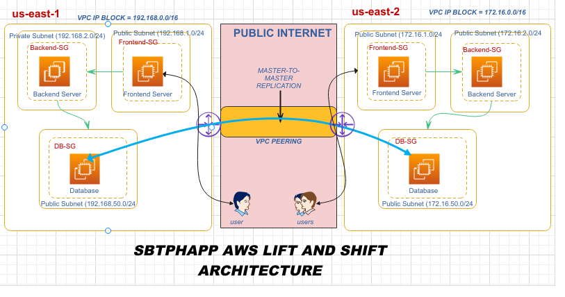

# SBTPHAPP-DEVOPS-PROJECT

This branch represents the next step in our DevOps journey, where we continue to enhance our knowledge and skills. Our focus is on introducing additional AWS services to further our goals, and in this branch, we've used four different techniques to build the project:

1. **AWS Console**: We've leveraged the AWS Management Console for manual setup and configuration. You can find a tutorial for using the AWS Console [here](aws_console/README.md).

2. **AWS CLI**: Automation was achieved through AWS Command Line Interface (CLI) commands. Learn how to use the AWS CLI [here](NOT YET FINISHED).

3. **CloudFormation**: We employed AWS CloudFormation for infrastructure as code (IaC) to define and provision our architecture. Explore AWS CloudFormation through this [tutorial](NOT YET FINISHED).

4. **Terraform**: The project also utilized Terraform, a popular IaC tool, for provisioning and managing AWS resources. Discover Terraform with this [tutorial](NOT YET FINISHED).

In this branch, we have refined our architecture with the aim of enhancing availability and security. We've further enhanced security by implementing HTTPS to secure our application. Additionally, we've added a custom DNS domain using GoDaddy to make our application accessible under a unique domain name.

In the previous "lift-and-shift" branch, we built the following architecture:

In this branch, here's the updated architecture:

Our objective is to introduce higher levels of availability, security, and a custom DNS domain to our application.
