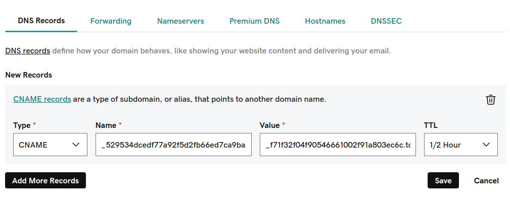
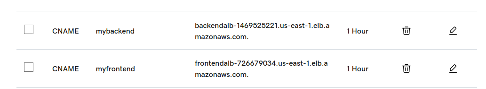
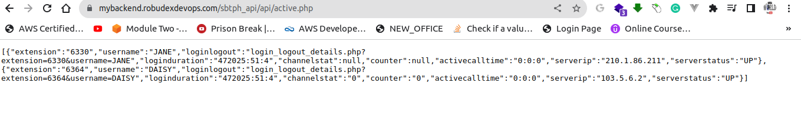
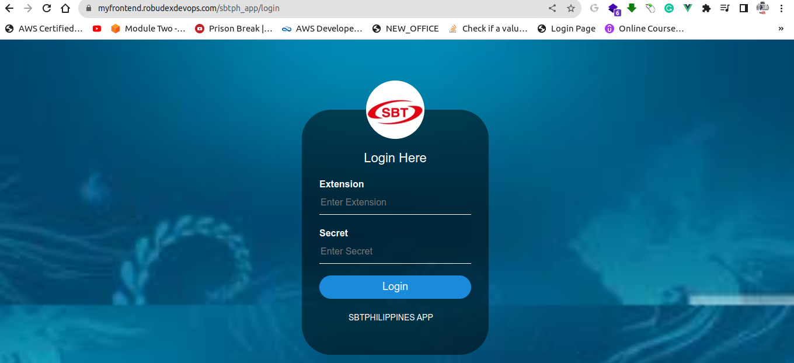
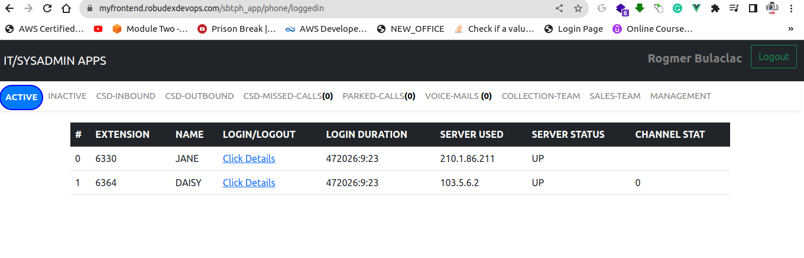

# AWS CLOUDFORMATION Setup for SBTPHAPP-DEVOPS-PROJECT

This README provides step-by-step instructions for setting up and configuring the SBTPHAPP-DEVOPS-PROJECT using AWS CloudFormation. Unlike using the AWS Console for stack creation, we will utilize the AWS Command Line Interface (CLI). The knowledge gained from the previous AWS CLI section will be applied in this guide.

In this guide, you will learn how to create and manage your CloudFormation stacks using the AWS CLI, allowing for more streamlined and automated deployment of your infrastructure.

## Prerequisites

Before you begin, ensure that you have the following:

- **AWS Access Key ID and AWS Secret Access Key** with Administrator Access to avoid any permission issues.

- **Knowledge of Linux commands:** Because this section is an AWS CLI edition, familiarity with Linux is a must. The AWS CLI must be installed and configured with your AWS Access Key ID and AWS Secret Access Key. To install AWS CLI click this link (https://docs.aws.amazon.com/cli/latest/userguide/getting-started-install.html)

- **Git Repository:** Clone this GitHub repository by running the following command:

    ```shell
    git clone -b lift-and-shift-high-availability https://github.com/robudexIT/sbtphapp-project-devops.git
    ```

    This cloned repository will serve as your working project directory.

- **Key Pairs:** Create two key pairs, one for `us-east-1` and one for `us-east-2`, and save them to your working project directory.

Please ensure that you have met these prerequisites before proceeding with the setup.

## Architecture Overview

Include a brief description and a diagram of the architecture built using the AWS CLOUDFORMATION.


## Setup Instructions
### 1. CLONNING PROJECT REPOSITORY:
      ```bash
        git clone -b lift-and-shift-high-availability https://github.com/robudexIT/sbtphapp-project-devops.git

      ```
   - Details Explaination
     This command clones a Git repository (sbtphapp-project-devops) and checks out the branch named **"lift-and-shift-high-availability."** This branch likely contains the project files and configuration needed for your deployment.

### 2. Change to Project Directory

      ```bash
        cd sbtphapp-project-devops
      ```
   - Details Explaination
     This command changes your current working directory to the directory you just cloned from the Git repository. You will typically find configuration files and scripts within this directory.

### 3. Create S3 Bucket for Cloudformation Templates (must unique)
      ```bash
        aws s3api create-bucket --bucket BUCKET_NAME --region YOURPRIMARYREGION
        
        #example:
        # aws s3api create-bucket --bucket robudexdevopsbucket --region us-east
      ```
   - Details Explaination
     This command creates an Amazon S3 bucket with the specified name (BUCKET_NAME) in a specific AWS region (YOURPRIMARYREGION). S3 buckets are used to store various files, including configuration files and application assets.


### 4. Copy nestedstack folder to newly created bucket

      ```bash
          aws s3 sync automation/cloudformation/nestedstack s3://YOUR_BUCKET_NAME/nestedstack

          #aws s3 sync automation/cloudformation/nestedstack s3://robudexdevopsbucket/nestedstack
      ```
   - Details Explaination
     This command copies a file or directory from your local system (in the automation/cloudformation/nestedstack directory) to an S3 bucket (s3://YOUR_BUCKET_NAME/nestedstack). This is a common way to upload configuration files to S3.

### 5.  Update your bucket name in rootstack.yaml filename
      ```bash

        sed -i 's/<YOUR-UNIQUE-BUCKET HERE>/<YOUR_CREATED_BUCKET>/g' automation/cloudformation/rootstack.yaml
        
        #  sed -i 's/<YOUR-UNIQUE-BUCKET HERE>/robudexdevopsbucket/g' automation/cloudformation/rootstack.yaml

      ```
   - Details Explaination
     This command uses the sed utility to perform a text replacement within the rootstack.yaml file. It replaces occurrences of YOUR_BUCKET_NAME with <YOUR-UNIQUE-BUCKET HERE>. This is often done to customize configuration files for your specific deployment.

### 6. Request for Certificate. 

      ```bash
        aws acm request-certificate --domain-name *.YOURVALIDDOMAINNAME --validation-method DNS --region YOURPRIMARYREGION
  
        #aws acm request-certificate --domain-name *.robudexdevops.com --validation-method DNS --region us-east-1
      ```
  - Details Explaination:  
    This command requests an SSL/TLS certificate from AWS Certificate Manager (ACM) for the domain name *.YOURVALIDDOMAINNAME. The --validation-method DNS flag indicates that DNS validation will be used to prove ownership of the domain .It's essential to take note of the certificate ARN (Amazon Resource Name), which is a unique identifier for the certificate generated during this step. You will need this ARN in the next step

### 7. Check Cerficate Status

      ```bash
        aws acm describe-certificate --certificate-arn <YOUR CERTIFICATED ARN>
      ```
   - Details Explaination:      
     This command retrieves information about the ACM certificate specified by its Amazon Resource Name (ARN). You would replace <YOUR CERTIFICATED ARN> with the actual ARN of the certificate you requested in the previous step.Please locate a similar piece of information below and copy it into your notepad.
    
      ```bash
          "ResourceRecord": {
                          "Name": "_529534dcedf77a92f5d2fb66ed7ca9ba.robudexdevops.com.",
                          "Type": "CNAME",
                          "Value": "_f71f32f04f90546661002f91a803ec6c.tctzzymbbs.acm-validations.aws."
          },
      ```


### 8. Update DNS Records (GoDaddy Example)

   - Details Explaination:    
    You need to add a DNS record to your domain registrar or DNS provider, such as GoDaddy, to complete the certificate validation process. This step may involve configuring a CNAME or TXT record with the required information provided by ACM during certificate creation.

   - On the image below, is adding this records in GoDaddy DNS provider

     

### 9. Check  Certificate Status
    
      ```bash
              aws acm describe-certificate --certificate-arn <YOUR CERTIFICATED ARN> 
      ```   
   - Details Explaination:
     This command checks the **'ValidationStatus'** If the 'ValidationStatus' equals **SUCCESS**, you can proceed to the next step. Please note that the validation process may take some time, so your patience is appreciated


### 10. Fillup us-east-1-parameters with your custom values
   - Details Explaination:  
    Fill up a JSON file named us-east-1-parameters.json located in the automation/cloudformation directory. This file likely contains configuration parameters for your AWS CloudFormation stack specific to the us-east-1 region.

### 11. Create the primary-stack

      ```bash
          aws cloudformation create-stack --stack-name primary-stack --template-body file://automation/cloudformation/rootstack.yaml --parameters file://automation/cloudformation/us-east-1-parameters.json --region YOURPRIMARYREGION

      ```
   - Details Explaination:    
     This command deploys an AWS CloudFormation stack named primary-stack using the CloudFormation template in the rootstack.yaml file and the parameter values provided in us-east-1-parameters.json. The deployment occurs in the YOURPRIMARYREGION (eg us-east-1).

### 12. Describing the primary-stack
   
      ```bash
            aws cloudformation describe-stacks --stack-name primary-stack --region YOURPRIMARYPREGION
      ```
   - Details Explaination:  
     By running this command, you can obtain detailed information about the CloudFormation stack, including its current status, the resources it contains, and various configuration details. This step can be useful for monitoring and troubleshooting the stack's deployment, especially in the primay region. Please note that creating the stack, which includes multiple child stacks, may take some time due to its complexity. 
   - Alternatively you can use this command below to filter the output and focus only on the  status of the stack: Run this command once every minute or two. Until the status change  from **"CREATE_IN_PROGRESS"** to **"CREATE_COMPLETE"**


        ```bash
              aws cloudformation describe-stacks --stack-name primary-stack --query "Stacks[0].StackStatus" --region YOURPRIMARYREGION
        ```   

   - Once the StackStatus is equal to **"CREATE_COMPLETE"**. Run the command below 

        ```bash
          aws cloudformation describe-stacks --stack-name primary-stack  --query "Stacks[0].Outputs" --region YOURPRIMARYREGION

          #aws cloudformation describe-stacks --stack-name primary-stack  --query "Stacks[0].Outputs" --region us-east-1

        ```   
   -  Add these Outputs Informations to your GoDaddy DNS Records
       ```bash 
          1. Type:  CNAME    
            Name: <FrontendSubdomain-Value>                               
            Value:  <FrontendALBDNSName-Value>

          2. Type:  CNAME    
            Name: <BackendSubdomain-Value>                               
            Value:  <BackendALBDNSName-Value>           

       ``` 
   -  Like in the screenshot below:

     
 
### 13. Testing The APP.
   
  - After adding the records, time to test our apps.

    Run the command below again, and take note the FrontendAPIhttps  and BackendAPIhttps values.

          ```bash
              aws cloudformation describe-stacks --stack-name primary-stack  --query "Stacks[0].Outputs" --region YOURPRIMARYREGION

              #aws cloudformation describe-stacks --stack-name primary-stack  --query "Stacks[0].Outputs" --region us-east-1
  
          ```
  -  For Backend Test, paste BackendAPIhttps to the browser and add /sbtph_api/api/active.php. If the output is same as the screenshot below, The backend is properly working.

  
 
  - For Frontend Test, paste  FrontendAPIhttps to the browser and add /sbtph_app/login. For credentials, **(extension: 6336, secret: 99999)**. If the outputs are the same as the screenshots below, The Frontend is properly working.

    

    


### 14. Fillup us-east-2-parameters with your custom values

Similar to step 10, you are instructed to fill up a JSON file named us-east-2-parameters.json located in the automation/cloudformation directory. This file likely contains configuration parameters for your AWS CloudFormation stack specific to the us-east-2 region.

### 15. Create the replica-stack

    ```bash
        aws cloudformation create-stack --stack-name primary-stack --template-body file://automation/cloudformation/rootstack.yaml --parameters file://automation/cloudformation/us-east-2-parameters.json --region YOURBACKUPREGION
        
      #  aws cloudformation create-stack --stack-name replica-stack --template-body file://automation/cloudformation/rootstack.yaml --parameters file://automation/cloudformation/us-east-2-parameters.json --region us-east-2
    ```

   - Details Explaination
    This command deploys another AWS CloudFormation stack with the same name, primary-stack, but in a different region (YOURBACKUPREGION). It uses the rootstack.yaml template and the parameters specified in us-east-2-parameters.json.


### 16. Deleting The Stacks 

     ```bash
        aws cloudformation delete-stack --stack-name primary-vpc-stack --region us-east-1
        aws cloudformation delete-stack --stack-name replica-vpc-stack --region us-east-2
     ```


