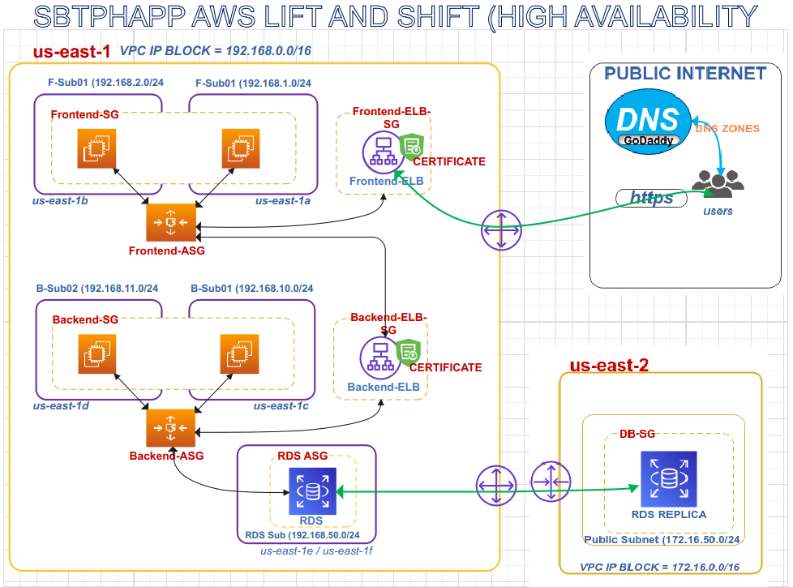
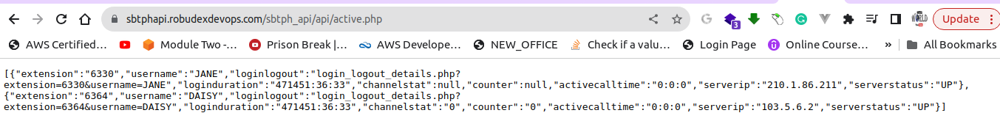
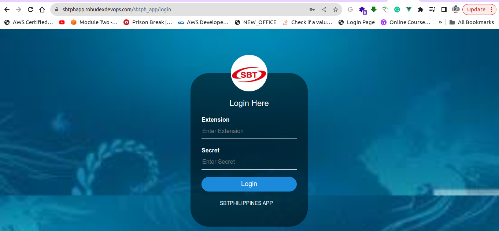

# AWS CLI Setup for SBTPHAPP-DEVOPS-PROJECT

This README provides step-by-step instructions for setting up and configuring the SBTPHAPP-DEVOPS-PROJECT using the AWS CLI.

## Prerequisites

Before you begin, ensure that you have the following:

- **AWS Access Key ID and AWS Secret Access Key** with Administrator Access to avoid any permission issues.

- **Knowledge of Linux commands:** Because this section is an AWS CLI edition, familiarity with Linux is a must. The AWS CLI must be installed and configured with your AWS Access Key ID and AWS Secret Access Key. To install AWS CLI click this link (https://docs.aws.amazon.com/cli/latest/userguide/getting-started-install.html)

- **Git Repository:** Clone this GitHub repository by running the following command:

    ```shell
    git clone -b lift-and-shift-high-availability https://github.com/robudexIT/sbtphapp-project-devops.git
    ```

    This cloned repository will serve as your working project directory.

- **Key Pairs:** Create two key pairs, one for `us-east-1` and one for `us-east-2`, and save them to your working project directory.

Please ensure that you have met these prerequisites before proceeding with the setup.

## Architecture Overview

Include a brief description and a diagram of the architecture built using the AWS CLI.




## Setup Instructions
### 1. Creating VPCs using AWS CloudFormation
   - Change to your working project directory as described in the **Prerequisites** section
   - Create a VPC using AWS CloudFormation in the us-east-1 region:

        ```bash
                aws cloudformation create-stack --stack-name primary-vpc-stack \
                --template-body file://automation/cloudformation/nestedstack/vpc.yaml \
                --parameters ParameterKey=VpcName,ParameterValue=primaryVpc ParameterKey=SSHLocation,ParameterValue=0.0.0.0/0 --region us-east-1

        ```
   - Use the command below to check the stack's comprehensive status where --stack-name=primary-vpc-stack:

        ```bash
            aws cloudformation describe-stacks --stack-name primary-vpc-stack --region us-east-1
        ```  
   - Wait until the "StackStatus" becomes "CREATE_COMPLETE". Alternatively, use the command below to filter the output message to "StackStatus" only:
   
     ```bash
        aws cloudformation describe-stacks --stack-name primary-vpc-stack --query "Stacks[0].StackStatus" --region us-east-1
 
     ```
   - Run the command below and copy the output in your notepad notes. These values are needed in the succeeding parts of the tutorial:
  
   ```bash
     aws cloudformation describe-stacks --stack-name primary-vpc-stack --query "Stacks[0].Outputs" --region us-east-1
     
   ```

   -  Creating VPC using  AWS Cloudformation in us-east-2 region

   ```bash
        aws cloudformation create-stack --stack-name replica-vpc-stack \
        --template-body file://automation/cloudformation/nestedstack/vpc.yaml \
        --parameters ParameterKey=VpcName,ParameterValue=replicaVpc ParameterKey=SSHLocation,ParameterValue=0.0.0.0/0 --region us-east-2

   ```
    
  - Use the command below to check the stack's comprehensive status where --stack-name=replica-vpc-stack:

    ```bash
        aws cloudformation describe-stacks --stack-name replica-vpc-stack --region us-east-2
    ```  
  - Wait until the "StackStatus" is "CREATE_COMPLETE". Alternatively, use the command below to filter the output message to "StackStatus" only:

     ```bash
      aws cloudformation describe-stacks --stack-name replica-vpc-stack --query "Stacks[0].StackStatus" --region us-east-2
    
     ```
   - Run the command below and copy the output in your notepad notes. These values are needed in the succeeding parts of the tutorial:
   
   ```bash
        aws cloudformation describe-stacks --stack-name replica-vpc-stack --query "Stacks[0].Outputs" --region us-east-2
    
   ```

### 2. Creating primary RDS instance. (You change master-username and master-user-password here )
  
  - Within your notes, please copy the value of **DatabaseSg** which is generated from the **primary-vpc-stack** CloudFormation stack and paste it into the vpc-security-group-ids field:

  ```bash
    aws rds create-db-instance --db-instance-identifier primarydbinstance \
    --db-instance-class db.t3.micro \
    --engine mysql \
    --engine-version 5.7.43 \
    --master-username admin \
    --master-user-password supersecretsecret2023 \
    --vpc-security-group-ids <DatabaseSg-VALUE-HERE> \
    --db-subnet-group-name dbsubnetgroupregion1 \
    --db-name sbtphapp_db \
    --backup-retention-period 1 \
    --allocated-storage 20 \
    --tags Key=Name,Value=primarydbinstance \
    --region us-east-1 \
    --no-publicly-accessible

  ```

   - For RDS instance comprehensive output: 

        ```bash
            aws rds describe-db-instances --db-instance-identifier primarydbinstance --region us-east-1
        ```
   - The command below verifies the status of the RDS instance with the identifier **'db-instance-identifier'** set to **'primarydbinstance.'** Please wait until the 'DBInstanceStatus' changes to **'available'**.:

        ```bash
        aws rds describe-db-instances --db-instance-identifier primarydbinstance --query "DBInstances[0].DBInstanceStatus" --region us-east-1     

        ```
   - Run this command and copy  the **Endpoint.Address** and **DBInstanceArn** to your notepad:

        ```bash
            aws rds describe-db-instances --db-instance-identifier primarydbinstance --region us-east-1

        ```
### 3. Launch Temporary Instance to Restore Database to rds Instance.

  - Execute this command to initiate a temporary instance. Retrieve the **BackendSg** value from your notes and insert it into the **vpc-security-group-ids** field. Similarly, locate the **BackendPubSub01** value and place it into the subnet-id field.:

  ```bash
     aws ec2 run-instances --image-id ami-0261755bbcb8c4a84 \
    --instance-type t2.micro \
    --key-name primary-ec2-keypair \
    --subnet-id <BackendPubSub01-VALUE-HERE>\
    --security-group-ids <BackendSg-VALUE-HERE> \
    --user-data file://userdata/database.sh \
    --tags Key=Name,Value=temporaryinstance \
    --region us-east-1   
  ```
 - Get the "PublicIpAddress" and "InstanceId" and save them in your notes.

  - Check instance status (make sure to change it with your **instance-ids**):

   ```bash
        aws ec2 describe-instance-status --instance-ids i-XXXXXXXXXXXX  
   ```

  - Wait until the output is similar to the ouput below:

   ```bash
      {
        "InstanceStatuses": [
            {
                "InstanceId": "i-XXXXXXXXXXXX",
                "InstanceState": {
                    "Code": 16,
                    "Name": "running"
                },
                "InstanceStatus": {
                    "Status": "ok"
                },
                "SystemStatus": {
                    "Status": "ok"
                }
            }
        ]
    }
  
   ``` 

   - SSH to the instance (change the it with your **keypair** and instance **PublicIpAddress**)
     
     ```bash
        ssh -i <YOURKEYPAIR.pem>  ubuntu@<INSTANCE-PublicIpAddress>
     ```
   - Once connected, type this command to restore the database from your working directory to the rds database instance. (**change with you RDS Endpoint address and rdsuser (which you set in rds creation)**) and enter your rds instance master-user-password.  
     
     ```bash
       cd /tmp/sbtphapp-project-devops/database
       ls
       mysql -uadmin sbtphapp_db -h <YOUR_DB_INSTANCE_Endpoint.Address> < sbtphapp_db.sql -p
     ```

   - Terminate the temporary instance (change it your instance-id)
   
        ```bash
            aws ec2 terminate-instances --instance-ids <instance-id>
        ```
### 4. Request for certificate
 - Change with your valid domain name:

     ```bash
            aws acm request-certificate --domain-name *.YOURVALIDDOMAINNAME --validation-method DNS
    ```
 - Please make sure to store the **CertificateArn** in your notes.

 - To describe the status of your certificate (replace 'your certificate arn' with your actual CertificateArn)

     ```bash
            aws acm describe-certificate --certificate-arn <YOUR CERTIFICATED ARN> 
    ```
- Please locate a similar piece of information below and copy it into your notepad.
    
     ```bash
        "ResourceRecord": {
                        "Name": "_529534dcedf77a92f5d2fb66ed7ca9ba.robudexdevops.com.",
                        "Type": "CNAME",
                        "Value": "_f71f32f04f90546661002f91a803ec6c.tctzzymbbs.acm-validations.aws."
        },
      ```
- Add the following as CNAME records under your domain (in my case, my domain name is registered with GoDaddy, so I add it like this). 
     
     ```bash 
       Type:  CNAME    
       Name: _529534dcedf77a92f5d2fb66ed7ca9ba                              
       Value:  f71f32f04f90546661002f91a803ec6c.tctzzymbbs.acm-validations.aws
    ```

- This command checks the **'ValidationStatus'** If the 'ValidationStatus' equals **SUCCESS**, you can proceed to the next step. Please note that the validation process may take some time, so your patience is appreciated

     ```bash
            aws acm describe-certificate --certificate-arn <YOUR CERTIFICATED ARN> 
     ```

### 5. Create backend_launch_template
   - Open the 'userdata/backend.sh' file, find the code section below, update it with your values, and remember to save the file..

   ```bash
     DB_HOST_IP=<primarydbinstance-DNS-ADDRESS-HERE>
     SBTPHAPP_USER=<primarydbinstance-USERNAME-HERE>
     SBTPHAPP_PWD=<primarydbinstance-PASSWORD-HERE>
   ```  

   - Encode 'backend.sh' into base64 encoding. Copy the base64 output and paste it into your notes.

        ```bash
            base64 -w 0 < userdata/backend.sh     
        ``` 

   - Run this command to create the 'backend_launch_template,' ensuring that you paste the base64 output into the '**UserData'** field. Refer to your notes to fill in the missing values for the required fields. 

        ```bash
            aws ec2 create-launch-template --launch-template-name backend-launch-template \
            --version-description "Initial version" \
            --region us-east-1 \
            --launch-template-data '{
            "UserData": <PASTE THE BASE64 OUTPUT HERE>,
            "ImageId": "ami-0261755bbcb8c4a84",
            "KeyName": "<YOUR-KEYPAIR-HERE>",
            "SecurityGroupIds": ["<BackendSg-VALUE-HERE>"]
            "InstanceType": "t2.micro"
            }'
        ```


### 6.Create backend target group

  - Retrieve the 'VPCID' from your Notepad notes, which is generated by the primary-vpc-stack CloudFormation stack, and then paste it into the **'vpc-id'** field..
   
    ```bash
        aws elbv2 create-target-group \
        --name backendTg \
        --protocol HTTP \
        --port 80 \
        --vpc-id <YOUR-PRIMARY-VPC-ID \
        --target-type instance \
        --tags Key=Name,Value=backendTg \
        --region us-east-1   
    ```
   - On output Look for **TargetGroupArn** and save it to your notes.

### 7.Create backend Application Loadbalancer 

  - From your notes, find the values for **BackendPubSub01** and **BackendPubSub02**, and insert them into the **--subnets** field. Also, locate the value for **BackendELBSg** and place it in the **--security-groups** field.

  ```bash
     aws elbv2 create-load-balancer \
    --name backendALB \
    --type application \
    --subnets BackendPubSub01-Value BackendPubSub02-Value \
    --security-groups BackendELBSg-Value \
    --scheme internet-facing \
    --ip-address-type ipv4 \
    --region us-east-1   

  ```  
  - Run this command  save  **"LoadBalancerArn"** and **DNSName** to your notepad notes.
    
    ```bash
        aws elbv2 describe-load-balancers --names backendALB
    ```

  - Run this command  to check the state of the backendALB state. When  **"State": {"Code": "provisioning" }** change to  **"State": {"Code": "active" }** you can proceed to the next steps.
   
   ```bash
     aws elbv2 describe-load-balancers --names backendALB --query "LoadBalancers[0].State"  

   ```
### 8. Create backendALBSecureListner

   - Refer to your notes and provide the values for the fields with missing information.

    ```bash
        aws elbv2 create-listener \
        --load-balancer-arn <YOUR-BACKENDALB-ARN-HERE> \
        --protocol HTTPS \
        --port 443 \
        --ssl-policy ELBSecurityPolicy-TLS13-1-2-2021-06 \
        --certificates CertificateArn=<YOUR-CERTIIFACATE-HERE> \
        --default-actions Type=forward,TargetGroupArn= <YOUR-BACKEND-TARGETGROUP-ARN-HERE> \
        --tags Key=Name,Value=443Listener \
        --region us-east-1

    ``` 

### 9. Create backend ASG

 -  Refer to your notes and provide the values for the fields with missing information..

    ```bash
        aws autoscaling create-auto-scaling-group \
        --auto-scaling-group-name backendASG \
        --launch-template LaunchTemplateName=backend-launch-template,Version=1 \
        --min-size 2 \
        --max-size 4 \
        --desired-capacity 2 \
        --availability-zones "us-east-1c" "us-east-1d" \
        --vpc-zone-identifier "BackendPubSub01-VALUE-HERE, BackendPubSub01-VALUE-HERE" \
        --health-check-type ELB \
        --target-group-arns <YOUR-BACKEND-TARGETGROUP-ARN-HERE> \
        --tags Key=Name,Value=backendASG \
        --region us-east-1

    ```
 - Run this command to check all instances **"LifecycleState"** **"LifecycleState"**  status. When all Instances  **"LifecycleState" is "InService", and "HealthStatus" is "Healthy".**, proceed to the next step
 
    ```bash
       aws autoscaling describe-auto-scaling-groups --auto-scaling-group-names  backendASG --query "AutoScalingGroups[0].Instances"
    ```
             
- Similarly you can run this command.

    ```bash
    aws elbv2 describe-target-health --target-group-arn  <YOUR-BACKEND-TARGETGROUP-ARN-HERE>

    ``` 
  - When you get output somewhat similar to this. Then you good to go.
    ```bash
            Output:
        {
            "TargetHealthDescriptions": [
                {
                    "Target": {
                        "Id": "i-09d9712f272e752ef",
                        "Port": 80
                    },
                    "HealthCheckPort": "80",
                    "TargetHealth": {
                        "State": "healthy"
                    }
                },
                {
                    "Target": {
                        "Id": "i-0f8886995d5433de6",
                        "Port": 80
                    },
                    "HealthCheckPort": "80",
                    "TargetHealth": {
                        "State": "healthy"
                    }
                }
            ]
        }
     ```

### 10. Create frontend_launch_template

   - Open the 'userdata/frontend.sh' file, find the code section below, update it with your values, and remember to save the file.

        ```bash 
            AWS_API_IP="<backendALB-DNS-HERE>"
        ```

   - Encode 'frontend.sh' into base64 encoding. Copy the base64 output and paste it into your notes.

        ```bash
            base64 -w 0 < userdata/frontend.sh     
        ``` 

   - Run this command to create the 'frontend_launch_template,' ensuring that you paste the base64 output into the '**UserData'** field. Refer to your notes to fill in the missing values for the required fields. 

        ```bash
            aws ec2 create-launch-template --launch-template-name frontend-launch-template \
            --version-description "Initial version" \
            --region us-east-1 \
            --launch-template-data '{
            "UserData": <PASTE THE BASE64 OUTPUT HERE>,
            "ImageId": "ami-0261755bbcb8c4a84",
            "KeyName": "<YOUR-KEYPAIR-HERE>",
            "SecurityGroupIds": ["<FrontendSg-VALUE-HERE>"]
            "InstanceType": "t2.micro"
            }'

        ```


### 11.Create frontend target group

  - Retrieve the 'VPCID' from your Notepad notes, which is generated by the primary-vpc-stack CloudFormation stack, and then paste it into the **'vpc-id'** field..
   
    ```bash
        aws elbv2 create-target-group \
        --name backendTg \
        --protocol HTTP \
        --port 80 \
        --vpc-id <YOUR-PRIMARY-VPC-ID \
        --target-type instance \
        --tags Key=Name,Value=frontendTg \
        --region us-east-1  

    ```
   - On output Look for **TargetGroupArn** and save it to your notes.

### 12.Create frontend Application Loadbalancer 

  - From your notes, find the values for **FrontendPubSub01** and **FrontendPubSub02**, and insert them into the **--subnets** field. Also, locate the value for **FrontendELBSg** and place it in the **--security-groups** field.

  ```bash
     aws elbv2 create-load-balancer \
    --name frontendALB \
    --type application \
    --subnets FrontendPubSub01-Value FrontendPubSub02-Value \
    --security-groups FrontendELBSg-Value \
    --scheme internet-facing \
    --ip-address-type ipv4 \
    --region us-east-1   
  ```  
  - Run this command  save  **"LoadBalancerArn"** and **DNSName** to your notepad notes.
    
    ```bash
        aws elbv2 describe-load-balancers --names frontendALB
    ```

  - Run this command  to check the state of the frontendALB state. When  **"State": {"Code": "provisioning" }** change to  **"State": {"Code": "active" }** you can proceed to the next steps.
   
   ```bash
     aws elbv2 describe-load-balancers --names frontendALB --query "LoadBalancers[0].State"  

   ```
### 13. Create frontendALBSecureListner

   - Refer to your notes and provide the values for the fields with missing information.

        ```bash
            aws elbv2 create-listener \
            --load-balancer-arn <YOUR-FRONTENDALB-ARN-HERE> \
            --protocol HTTPS \
            --port 443 \
            --ssl-policy ELBSecurityPolicy-TLS13-1-2-2021-06 \
            --certificates CertificateArn=<YOUR-CERTIIFACATE-HERE> \
            --default-actions Type=forward,TargetGroupArn= <YOUR-FRONTEND-TARGETGROUP-ARN-HERE> \
            --tags Key=Name,Value=443Listener \
            --region us-east-1
        ``` 

### 14. Create frontend ASG

 -  Refer to your notes and provide the values for the fields with missing information..

    ```bash
        aws autoscaling create-auto-scaling-group \
        --auto-scaling-group-name frontendASG \
        --launch-template LaunchTemplateName=frontend-launch-template,Version=1 \
        --min-size 2 \
        --max-size 4 \
        --desired-capacity 2 \
        --availability-zones "us-east-1a" "us-east-1b" \
        --vpc-zone-identifier "FrontendPubSub01-VALUE-HERE, FrontendPubSub01-VALUE-HERE" \
        --health-check-type ELB \
        --target-group-arns <YOUR-FRONTEND-TARGETGROUP-ARN-HERE> \
        --tags Key=Name,Value=frontendASG \
        --region us-east-1

    ```
 - Run this command to check all instances **"LifecycleState"** **"LifecycleState"**  status. When all Instances  **"LifecycleState" is "InService", and "HealthStatus" is "Healthy".**, proceed to the next step
 
    ```bash
       aws autoscaling describe-auto-scaling-groups --auto-scaling-group-names  frontendASG --query "AutoScalingGroups[0].Instances"
    ```
             
- Similarly you can run this command.

    ```bash
    aws elbv2 describe-target-health --target-group-arn  <YOUR-FRONTEND-TARGETGROUP-ARN-HERE>

    ``` 
  - When you get output somewhat similar to this. Then you good to go.
    ```bash
            Output:
        {
            "TargetHealthDescriptions": [
                {
                    "Target": {
                        "Id": "i-09d9712f272e752ef",
                        "Port": 80
                    },
                    "HealthCheckPort": "80",
                    "TargetHealth": {
                        "State": "healthy"
                    }
                },
                {
                    "Target": {
                        "Id": "i-0f8886995d5433de6",
                        "Port": 80
                    },
                    "HealthCheckPort": "80",
                    "TargetHealth": {
                        "State": "healthy"
                    }
                }
            ]
        }
     ```

### 15. Createing rds readreplica
- For source-db-instance-identifier replace it with your own aws account number  arn:aws:rds:us-east-1:<YOUR-AWS-ACCOUNT-NUMBER>:db:primarydbinstance

```bash

    aws rds create-db-instance-read-replica \
    --db-instance-identifier readreplicadbinstance \
    --source-db-instance-identifier arn:aws:rds:us-east-1:<YOUR-AWS-ACCOUNT-NUMBER>:db:primarydbinstance \
    --db-instance-class db.t3.micro \
    --no-publicly-accessible \
    --db-subnet-group-name dbsubnetgroupregion2 \
    --vpc-security-group-ids REPLICA-VPC-STACK-DatabaseSg-Value-HERE \
    --source-region us-east-1 \
    --tags Key=Name,Value=readreplicadbinstance \
    --region us-east-2 

```

- You can get the rds replica status by this command
  ```bash
    aws rds describe-db-instances --db-instance-identifier readreplicadbinstance --query "DBInstances[0].DBInstanceStatus" --region us-east-2
  ```

### 16. For testing

   - From your notes get the  frontendALB and backendALB **DNSName** values. Open your goddady account. Under Your domainname create 2 new CNAME records similar to this.
   The Name of the Backend and Frontend records depends upon you. (in my case I name it sbtphapi for backend and sbtphapp for frontend.)
  
        ```bash
            Backend:
                Type: CNAME
                Name: sbtphapi
                Value: <backendALB-DNS-HERE>

            Frontend:
                Type: CNAME
                Name: sbtphapp
                Value: <frontendALB-DNS-HERE>
            
        ```

   - For backend, open the browser and copy the paste this url https://<BACKEND-NAME-HERE>.<YOUR-DOMAIN-HERE>/sbtph_api/api/active.php (eg https://sbtphapi.robudexdevops.com/sbtph_api/api/active.php) The ouput should similar to this <br \> <br \>

     

  
  

   - For Frontend, open the browser and copy the paste this url https://<FRONTEND-NAME-HERE>.<YOUR-DOMAIN-HERE>/sbtph_app/login. (eg https://sbtphapp.robudexdevops.com/sbtph_app/login) The ouput should similar to this <br \> <br \>


  


# DELETING  AWS RESOUCES (Please dont forget to delete your resources.)

### 1.delete frontend and backend ALB
 
  ```bash
        aws elbv2  delete-load-balancer --load-balancer-arn <YOUR-BACKENDALB-ARN-HERE> --region us-east-1  

        aws elbv2  delete-load-balancer --load-balancer-arn <YOUR-FRONTENDALB-ARN-HERE> --region us-east-1  

  ```
  - For checking..

  ```bash
    
     aws elbv2  describe-load-balancer

  ```
  - Make sure the output is this
    {
        "LoadBalancers": []
    }


### 2.Delete fronted and backend Target group

  ```bash
      aws elbv2 delete-target-group --target-group-arn <FRONTEND-TARGETGROUP-ARN-HERE> --region us-east-1

       aws elbv2 delete-target-group --target-group-arn  <BACKEND-TARGETGROUP-ARN-HERE> --region us-east-1
  ```
  - For checking...

  ```bash
     aws elbv2 describe-target-groups   
  ```
 
  - Make sure the ouput is similar to this

    {
        "TargetGroups": []
    }

### 3.Delete ASG

  ```bash
     aws autoscaling delete-auto-scaling-group --force-delete  --auto-scaling-group-name backendASG  --region us-east-1

     aws autoscaling delete-auto-scaling-group --force-delete  --auto-scaling-group-name frontendASG --region us-east-1
  ```
  For Checking...

  ```bash

     aws autoscaling describe-auto-scaling-groups

  ```
  Make sure the output is similar to this:
    {
        "AutoScalingGroups": []
    }


### 4.Delete launch template 
  
  ```bash
    aws ec2 delete-launch-template --launch-template-id <backend-template-id-here> --region us-east-1

    aws ec2 delete-launch-template --launch-template-id <frontkend-template-id-here> --region us-east-1
  ```
  For checking...

  ```bash
     aws ec2 describe-launch-templates -region us-east-1
  ```
  
  Make sure the output is similar to this:

    {
        "LaunchTemplates": []
    }

 ### 5.Delete rds instances 

   ```bash
      aws rds delete-db-instance --db-instance-identifier primarydbinstance  --skip-final-snapshot --region us-east-1
      
     aws rds delete-db-instance --db-instance-identifier readreplicadbinstance  --skip-final-snapshot --region us-east-2

  ```
 For checking 

  ```bash
    aws rds descibe-db-instances --region us-east-1
     aws rds descibe-db-instances --region us-east-2

  ```
  Make sure the output is similar to this:

   {
    "DBInstances": []
   }

 ### 6. delete vpc cloudformation templates 
  
  ```bash
      aws cloudformation delete-stack --stack-name primary-vpc-stack --region us-east-1
      aws cloudformation delete-stack --stack-name replica-vpc-stack --region us-east-2
  ```


  


    

   

