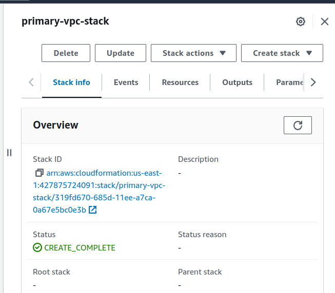
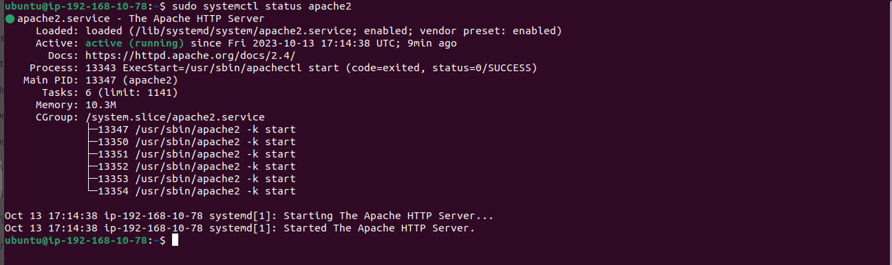
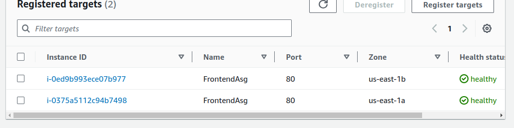

# AWS Console Setup for SBTPHAPP-DEVOPS-PROJECT

This README provides step-by-step instructions for setting up and configuring the SBTPHAPP-DEVOPS-PROJECT using the AWS Management Console.


## Table of Contents
- [Prerequisites](#prerequisites)
- [Architecture Overview](#architecture-overview)
- [Setup Instructions](#setup-instructions)
  1. [Creating VPCs using AWS Cloudformation](#1-creating-vpcs-using-aws-cloudformation)
  2. [Creating primary RDS instance](#2-creating-primary-rds-instance)
  3. [Launch Temporary Instance to restore database](#3-launch-temporary-instance-to-restore-database-to-rds-instance)
  4. [Creating Backend Launch Template, ASG, ALB](#4-creating-backend-launch-template-asg-alb)
  5. [Creating Frontend Launch Template, ASG, ALB](#5-creating-frontend-launch-template-asg-alb)
- [Availability](#availability)
  6. [Database (create replica)](#6-database-create-replica)
  7. [Frontend and Backend](#7-frontend-and-backend)
- [Security and Adding Custom DNS](#security-and-adding-custom-dns)
  8. [Create AWS Certificate](#8-create-aws-certificate)
  9. [Adding backendALB and frontendALB dns name records to GoDaddy](#9-adding-backendalb-and-frontendalb-dns-name-records-to-godaddy)
  10. [Adding HTTPS Listeners on backendALB and frontendALB](#10-adding-https-listeners-on-backendalb-and-frontendalb)
  11. [Test API and APP via secure connection](#11-test-api-and-app-via-secure-connection)
- [Contributing](#contributing)


## Prerequisites

Before you begin, ensure that you have the following:

- **AWS Account:** You must have an AWS account with the necessary permissions.

- **Basic AWS Knowledge:** Familiarity with AWS services and console navigation is required.

- **Git Repository:** Clone this GitHub repository by running the following command:

    ```shell
    git clone -b lift-and-shift-high-availability https://github.com/robudexIT/sbtphapp-project-devops.git
    ```

    This cloned repository will serve as your working project directory.

- **Key Pairs:** Create two key pairs, one for `us-east-1` and one for `us-east-2`, and save them to your working project directory.

Please ensure that you have met these prerequisites before proceeding with the setup.


## Architecture Overview

Include a brief description and a diagram of the architecture built using the AWS Console in the previous branch. 


**Note:** Because it's easy to forget the configuration when creating VPCs, we will create VPCs using CloudFormation templates. (This is the only automation in this tutorial; all other steps are manually created.)

## Setup Instructions
### 1. Creating VPCs using AWS CloudFormation
- Log in to your AWS Console.
- Go to [AWS Console](https://aws.amazon.com/console/) and select AWS CloudFormation.
- Select the `us-east-1` region and click "Create Stack."
- Choose "Upload a template file" and upload the `vpc.yaml` (located in the `automation/cloudformation` folder) and click "Next."
- For `SSHLocation`, use `0.0.0.0/0` (or your chosen IP address for SSH access) and for `VpcName`, use `primaryVpc`. Click "Next."instance)  For VpcName: primaryVpc. Click Next
  - Go to the bottom and click Next
  - Got to the bottom and click Submit
  - When cloudformation stack Status is : **CREATE_COMPLETE** as can be seen below

   

  - click the Outputs tab. And availble to see the resources that created by cloudformation.

    

  - Select us-east-2 region and upload the same vpc.yaml 
  - For SSHLocation: 0.0.0.0/0 (or your chosen ip address you want to allow ssh access to your instance)  For VpcName: replica-vpc. Click Next
  - Go to the bottom and click Next
  - Got to the bottom and click Submit
  - When cloudformation stack Status is : **CREATE_COMPLETE** as can be seen below

   

  - click the Outputs tab. And available to see the resources created by Cloudformation.

    


### 2. Creating primary RDS instance.
  - Switch back to us-east-1 go to RDS Services and click Create database
  - For Engine options, select MySQL For Engine Version: MySQL 5.7.43 
  - Templates should be Free tier
  - DB instance identifier: **primarydbinstance**
  - Master username: admin
  - For password check Auto-generate a password
  - DB instance class: **db.t3.micro** 
  - Storage type: General Purpose SSD (gp2), Allocated storage: 20(GiB)
  - For Virtual private cloud(VPC). choose the vpc with the name: primaryVpc 
  - DB subnet group: **dbsubnetgroupregion1**
  - Public access: choose No
  - VPC security group (firewall)->Choose existing and choose security group with the name: primary-vpc-stack-DatabaseSg-*****
  - Click Additional configuration and these Database options
  - Initial database name : **sbtphapp_db**
  - Because we plan to make replication on this rds instance, we need at least 1 Backup retention. 
  - Click Create database and wait for RDS Instance status:Available 
  - Click View credentials details. And then save the db credentials. This message will pop up once. It's important to secure your credentials before proceeding to the next steps
  - In addition, go to primarydbinstance -> Connectivity & security and save the Endpoint string. You will need it later.


### 3. Launch Temporary Instance to restore database to rds instance.
   - Launch an EC2 Instance on us-east-1 region with this following settings:
   - Name: temporaryinstance
   - AMI: Ubuntu Server 20.04 LTS(HVM), SSD Volume Type (Free tier eligible)
   - Key pair (login): <your us-east-1-ec2-keypair>
   - VPC: primaryVpc
   - Subnet: BackendPubSub01
   - Security groups: primary-vpc-stack-BackendSg-****
   - For User data copy this script 
     ```bash
        #!/bin/bash
        sudo apt update -y
        sudo apt install mariadb-server -y
        sudo apt install git -y
        sudo systemctl enable mariadb
        sudo systemctl start mariadb
       cd /tmp && git clone -b  lift-and-shift  https://github.com/robudexIT/sbtphapp-project-devops.git
     ```
     
    

  - Click Launch instance and wait for status: 2/2 checks passed
  - Click the  temporayinstance-> Actions-> Connect
  - Click SSH client tab and copy the connection string under the Example: 
  - goto the terminal -> cd to your working project directory, paste the connection string and press enter. if you see the message (Are you sure you want to continue connecting (yes/no/[fingerprint]))? type yes.
  - Once connected, type this command to restore the database from your working directory to the rds database instance.   
     ```bash
       cd /tmp/sbtphapp-project-devops/database
       ls
       mysql -uadmin sbtphapp_db -h <YOUR_DB_INSTANCE_ENDPOINT> < sbtphapp_db.sql -p
     ```
  - Enter your rds instance password
  - Refer to the  screenshot below: 

   

  - To verify that the database was successfully restored, login on the following command:
      ```bash
        mysql -uadmin  -h <YOUR_DB_INSTANCE_ENDPOINT>  -p
      ```
  - Enter your password
  - from mysql console type use **sbtphapp_db;** then  type **show tables;**
  - If you can see these tables like the figure below, restoration is successful.
  

     

    - You are now ready for the next step. Type exit to the mysql console.
    - And Terminate this temporary instance.


  ### 4. Creating Backend Launch Template,ASG ALB.
 
  ### Create Launch Template
  - goto EC2 Services and Look for Create Launch template
  - Launch template name: backend_launch_template
  - Template version description: backend_launch_template
  - AMI: Ubuntu Server 20.04 LTS
  - Instance Type: t2.micro
  - Key pair: <YOUR US-EAST-1 EC2 KEYPAIR>
  - security groups: primary-vpc-stack-BackendSg-******
  - Open backend.sh which can be found under userdata folder of your working project directory. change the DB_HOST_IP, SBTPHAPP_USER and SBTPHAPP_PWD with your own rds instance credentials.
  - Goto User data of the launch template section and paste the content of the newly updated backend.sh file
  
  


    ### Create backendASG
  - Under EC2 Services click Auto Scaling Groups
  - Auto Scaling group name: **backendAsg**
  - Launch template: backend_launch_template (the one that you created earlier.) and Click Next
  - Under Network, on VPC: primaryVpc and on Availability Zones and subnets: BackendPubSub01, and BackendPubSub02. Then Click Next

   

 - Load balancing: No load balancer (for now)
 - Health checks: EC2 health checks (for now)
 - go to the bottom and click Next
 - Group size (Desire capacity: 1, Minimum capacity: 1, Maximum capacity: 1)
 - go to the bottom and click Next
 - Don't  add any notifications and just Click Next
 - For  Tags add a tag (Key: Name, Value: BackendAsg) and Click Next
 - Finally,  Click Create Auto Scaling group. And wait until the Status of becoming Active / Ready 
 - When backendAsg is ready, click it go to Instance Management tab. You should see one Instance created.
 - Click the Instance ID. Wait for the Instance to Status to 2/2 checks passed.
 - As of now, we can test the single backend instance if it is working.
 - SSH to this instance the type the following command:
   ```bash
        sudo systemctl status apache2
        cat /var/www/html/sbtph_api/config/database.php
        curl http://{REPLACE_INSTANCE_PRIVATE_IP}/sbtph_api/api/active.php 
   ```
  - You should the same results below.

  
  
  
  
  
  
 
  ### Create target group
  - Under EC2 Services->Load Balancing click Target Groups and Click Create target group
  - Choose a target type: Instances
  - Target group name: BackendTg
  - Protocol: TCP, Port: 80
  - IP address type: IPV4
  - VPC: primaryVpc
  - Under Health checks (Health check protocol: HTTP, Health check path: /)
  - Tags (Key: Name, Value: BackendTg) and Click Next
  - Go to the bottom and click Create target group
 
    ### Create load balancer
  - Under EC2 Services->Load Balancing click Load Balancers and Click Create load balancer
  - Look for ALB and Click Create
  - Load balancer name: BackendALB
  - Scheme: Intert-facing
  - IP address type: IPV4
  - VPC: primaryVpc
  - Mappings: check us-east-1c from the Subnet dropdown menu: select BackendPubSub01, check us-east-1d as well from the Subnet dropdown menu select BackendPubSub02
  - Security groups: primary-vpc-stack-BackendELBSg-****
  - Under Listeners and routing, Create Listener (Protocol:HTTP , Port: 80, Default action: (in the dropdown list, Select BackendTg))
  - Load balancer tags (Key:Name Value: BackendALB)
  - Review the Summary and click Create load balancer
  - Wait for the BackendALB status to Active
 
  ### Edit BackendASG Load balancing and Health checks attribute
  - Click BackendAsg and edit the Load balancing. Under Load balancers check (Applicaiton, Network or Gateway Load Balancers targets). Under dropdown list, Select BackendTg. and click Update
  - Click BackendClick BackendAsg and edit Health checks. Under Additional health check types, check (Turn on Elastic Load Balancer health checks) and click Update.
 
  ### Test BackendALB
  - Goto EC2-> Load Balancers
  - Select BackendALB
  - Under Description: Copy the DNS name  and paste it to the browser address bar.
  - add /sbtph_api/api/active.php at the end the BackendALB DNS record and press enter.
  - The result should be equal in the screenshot below

  

  ### 5. Creating Frontend Launch Template,ASG ALB.
 
  ### Create Launch Template
  - goto EC2 Services and Look for Create Launch template
  - Launch template name: frontend_launch_template
  - Template version description: frontend_launch_template
  - AMI: Ubuntu Server 20.04 LTS
  - Instance Type: t2.micro
  - Key pair: <YOUR US-EAST-1 EC2 KEYPAIR>
  - security groups: primary-vpc-stack-FrontendSg-******
  - Open frontend.sh which can be found under userdata folder of your working project directory. change the AWS_API_API equals to the DNS Name of BackendALB
  - Goto User data of the launch template section and paste the content of the newly updated frontend.sh file
  
  

  ### Create FrontendASG
  - Under EC2 Services click Auto Scaling Groups
  - Auto Scaling group name: frontend-Asg
  - Launch template: fronted_launch_template (the one that you created earlier.) and Click Next
  - Under Network, on VPC: primaryVpc and on Availability Zones and subnets: FrontendPubSub01, and FrontendPubSub02. Then Click Next


 - Load balancing: No load balancer (for now)
 - Health checks: EC2 health checks (for now)
 - go to the bottom and click Next
 - Group size (Desire capacity: 1, Minimum capacity: 1, Maximum capacity: 1)
 - go to the bottom and click Next
 - Don't  add any notifications and just Click Next
 - For  Tags add a tag (Key: Name, Value: FrontendAsg) and Click Next
 - Finally,  Click Create Auto Scaling group. And wait until the Status of becoming Active / Ready 
 - When frontendAsg is ready, click it and go to Instance Management tab. You should see one Instance created.
 - Click the Instance ID. Wait for the Instance to Status to 2/2 checks passed.
 - As of now, we can test the single frontend instance if it is working.
 - Copy frontend instance Public IP address and add (/sbtph_app/)
   ```bash
        http://{INSTANCE_PUBLIC_IP_ADDRESS/sbtph_app/}
        extension: 6336
        secret: 99999
   ```
  - You should the same results below.

  

    ### Create a target group
  - Under EC2 Services->Load Balancing click Target Groups and Click Create target group
  - Choose a target type: Instances
  - Target group name: FrontendTg
  - Protocol: TCP, Port: 80
  - IP address type: IPV4
  - VPC: primaryVpc
  - Under Health checks (Health check protocol: HTTP, Health check path: /)
  - Tags (Key: Name, Value: FrontendTg) and Click Next
  - Go to the bottom and click Create target group
 
    ### Create load balancer
  - Under EC2 Services->Load Balancing click Load Balancers and Click Create load balancer
  - Look for ALB and Click Create
  - Load balancer name: FrontendALB
  - Scheme: Intert-facing
  - IP address type: IPV4
  - VPC: primaryVpc
  - Mappings: check us-east-1a from the Subnet dropdown menu: select FrontendPubSub01, check us-east-1b as well from the Subnet dropdown menu select FrontendPubSub02
  - Security groups: primary-vpc-stack-BackendELBSg-****
  - Under Listeners and routing, Create Listener (Protocol:HTTP , Port: 80, Default action: (in the dropdown list, Select FrontendTg))
  - Load balancer tags (Key:Name Value: FrontendALB)
  - Review the Summary and click Create load balancer
  - Wait for the FrontendALB status to Active
 
  ### Edit FrontendASG Load balancing and Health checks attribute
  - Click FrontendAsg and edit the Load balancing. Under Load balancers check (Application, Network or Gateway Load Balancers targets). Under the dropdown list, Select FrontendTg. and click Update
  - Click  BackendAsg and edit Health checks. Under Additional health check types, check (Turn on Elastic Load Balancer health checks) and click Update.
 
  ### Test BackendALB
  - Goto EC2-> Load Balancers
  - Select FrontendALB
  - Under Description: Copy the DNS name  and paste it to the browser address bar.
  - add /sbtph_app/ at the end of the FrontendALB DNS record and press enter.
  - extension: 6336, secret: 99999
  - The result should be equal in the screenshot below

  
 

At this point, the project was done, and functional but it lacked availability and security features.
making turning availability features is quite simple. However, adding security features and a custom domain will require a valid domain name. If you don't have a domain name yet you can skip this section.

### 6 AVAILABILITY 

### Database (create replicadb)
 -  Click **primarydbinstance** go to Actions and select Create read replica
 
 

 -  Under Settings (Replica source: **primarydbinstance**, DB instance identifier: r**eplicainstance**,DB instance class: db.t3.micro)
 - Under AWS Region (Destination Region: US East(Ohio))
 - Availability: Single DB Instance (If you really high level of Availability Choose Multi-AZ DB Instance)
 - Network Type: IPv4
 - DB subnet group: dbsubetgroupregion2
 - Public access: Not publicly accessible
 - Existing VPC security groups: backup-vpc-stack-DatabaseSg-****
 - Click Create read replica
 - Wait until r**eplicadbinstance** Status: Available

 ### Frontend and Backend
  - Select **backendAsg** and edit the Group size (Desire capacity:2 Minimum:2 Maximum 4) and click Update
  - Select **frontendAsg** and edit the Group size (Desire capacity:2 Minimum:2 Maximum 4) and click Update
  - Wait for a couple of minutes and go to BackendTg and FrontendTg you should see two instances per target group.

  

  


### 7. Security and Adding Custom DNS
 
 ### Create AWS Certificate
 - Goto AWS Certificate Manager (ACM)
 - Select Request certificate  -> then select Request a public certificate. (You should have a valid domain name  to make it happen.)
 - In my case, I have one (robudexdevops.com) so I can  request for a certificate.
 - Under Domain names (Fully qualified domain name: *.YOUR_VALID_DOMAIN_NAME) eg. *.robudexdevops.com
 - Add Tags (Key:Name, Value:MyAppCert) and Click Request
 - You have  now a Certificate ID but the status is Pending validation. 
 - Click your Certificated ID Copy the CNAME name 

  
  
 - Open your goddady account -> DNS Management -> DNS Records -> Add New Record
 - Under Type Select: CNAME , Name: (Paste your CNAME here but remove the trailing domain name) eg if my CNAME is _sldfoajlajr85.robudexdevops.com put only the _sldfoajlajr85. for the Value(copy the CNAME value but remove the trailing dot (.))
 
  
  
 - The request for a certificate may take some time. 
 - If the status is now available, We can proceed to the next steps. Otherwise, we have to wait.
 
  ### Adding backendALB and frontendALB DNS name records to GoDaddy
  - Open your GoDaddy account -> DNS Management -> DNS Records -> Add New Record
  - Type: CNAME, Name:sbtphapi , Value: (backendALB Domain Name)
  - Type: CNAME, Name:sbtphapp , Value: (frontendALB Domain Name)

    

   ### Adding HTTPS Listeners on backendALB and frontendALB
   - Select backendALB and click Add listener
   - Protocol:HTTPS, Port: 443 Default action: BackendTg
   - Certificate source: Select (From ACM)
   - On Certificate (from ACM): Select your certificate on the dropdown list
   - Tag (Key:Name, Value: backend-securelistener)
   - Select frontendALB and click Add listener
   - Protocol:HTTPS, Port: 443 Default action: FrontendTg
   - Certificate source: Select (From ACM)
   - On Certificate (from ACM): Select your certificate on the dropdown list
   - Tag (Key:Name, Value: frontend-securelistener)
   - Under Listeners and rules you will now see two listeners

   
  
  - You can delete the http:80 listeners(not secure one)

  ### Test API and APP via secure connection
  - https://sbtphapi.robudexdevops.com/sbtph_api/api/active.php

  
  
  - https://sbtphapp.robudexdevops.com/sbtph_app/login

  


# Contributing

If you have suggestions for improving this README or would like to contribute to the project, please feel free to submit a pull request.


