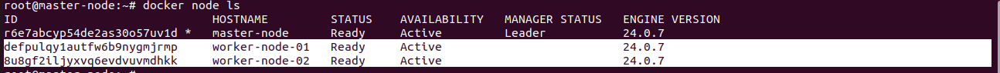
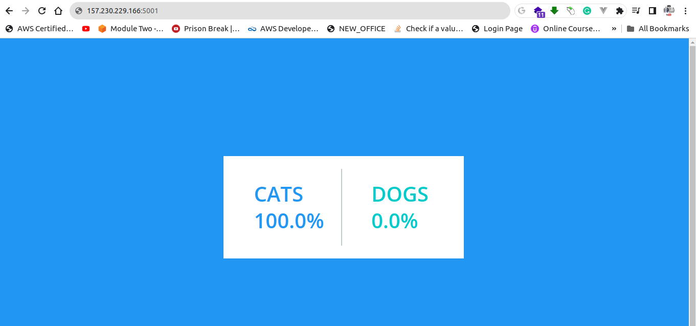

# Docker Swarm

As we dig deeper on our learning  Container Technology (as part of DevOps), we rialize that although docker  is  very powerful yet its have many limitations. 

The problems in docker are but not limited to:
 - Container might crash all the time and docker alone has no self healing features you have to manually replace it.
 - Auto-Scaling and Loadbalancing is not possible
 - Although you can use a tool like docker compose for defining and running multi-container Docker applications, still it a Single Host Focus. Container communications between to Docker Host can be quite challenging and hard to close to impossible to setup.
- Not suited on a large scale deployments (production)
- And the list is going on and on


## Solutions -> (Container Orchestration and Cluster Management) and two of most popular candidate that I know:
- Kubernetes
- Docker Swarm(which native to docker). Which we explore, study, and learn its features

## Note: We will explore, study, learn and implement Kubernetes to our project as we progress to our learning journey towards DevOps. Kubernetes is one of the important technology in DevOps and we will not skip it.


# Docker Swarm
 - swarm is consist of multiple Docker hosts which run in **swarm mode**
 - its have the concept of Manager and Worker Node
 - Manager Node where we submit our service definition.  The manager node dispatches units of work called tasks to worker nodes.
 - Worker Nodes - receive and execute tasks dispatched from manager nodes.
 - A service is the definition of the tasks to execute on the manager or worker nodes. It is the central structure of the swarm system and the primary root of user interaction with the swarm.
 - A task carries a Docker container and the commands to run inside the container. 
 - For the details concept of docker swarm please read the documentation: https://docs.docker.com/engine/swarm/


 # Docker Swarm in Action
  As I always said, learning by doing is the best way to learn so we build Docker Swarm Cluster. We will  build this simple architecture below: (1 Manger Node and 2 Worker Nodes)


## Setup Instuctions Part1:
 **Note: I built my Docker Swarm Project using Digital Ocean because it has free 200$ consumable for 2months.**

 - Create **3 droplets** in same Datacenter, OS: 20.04 Ubuntu Server,Basic Plan, Regular Disk Type, 4GB of RAM/2CPUs
 - Name the Hostname as master-node, workder-node01, workder-node02
 - Choose Password as Authentication Method
 - Click Create Droplet Button
 - Once All Servers are ready, Install docker engine on the 3 Servers
 - For installation of docker Engine in Ubuntu 20.04, click this link https://docs.docker.com/engine/install/ubuntu/
 - After Install docker, verify that docker is runnng by typing command:

   ```bash
      systemctl status docker
   ```
   

- On the manager-node, type the command:  
    ```bash
        docker info
    ```
   

- Notice that the swarm is currently inactive. Get manager-node etho ip address(the one with public) and type the command: 

  ```bash
     docker swarm init --advertise-addr <YOUR-IP-ADDRESS>   
  ```
  
    
- Copy the docker swarm join --token ****** on the  screen output and paste it in worker-node01 and worker-node02

- On the manager-node, type the command
 
 ```bash
    docker node ls
 ```

  

- As you can see on the ouput, the newly joined, worker-node01 and worker-node02 


# Setup Instruction Part2 (Deploy Project on the newly build Docker Swarm Project).

As we delve into the Docker Swarm concept and work on conceptualizing the implementation of our sbtphapp-project-devops, there is a need for additional practice to better understand the intricacies. To facilitate this learning process, we have identified a project on GitHub that is owned by Docker themselves: https://github.com/dockersamples/example-voting-app.git. This project, which has been well-established, will serve as a valuable resource for deploying an existing application, ensuring a reliable foundation for our Docker Swarm learning journey.

**Note: All of the configuration and creation are implemented in manager-node**

- On the manager-node, Clone the project:
  ```bash
     git clone https://github.com/dockersamples/example-voting-app.git
  ```
- According, to the project documentation, if you are using  docker swarm, you can just type the command on the manager-node and the project will automatically setup:
 
  ```bash
     docker stack deploy --compose-file docker-stack.yml vote
  ```
- However, we've opted not to take that streamlined approach, as it would hinder our learning objectives in exploring Docker Swarm. Instead, we are committed to a more hands-on experience by manually figuring out the deployment process. This intentional decision is driven by our desire to gain a deeper understanding of the intricacies involved in deploying projects on Docker Swarm, allowing us to develop a comprehensive skill set in managing containerized applications..

- If you open docker-stack.yml, for project to work, we will need to create 5 Services **(db, vote,redis,result,worker) and 2 Networks (frontend, backend)**

- Alright, so we're kicking things off by diving into networks because it seems like the easier part to start with. After a bit of Googling, we found out that the network we're dealing with is of the **overlay** type. Apparently, this **overlay network driver** is all about creating a network that spans multiple Docker daemon hosts. So, our first move is to get this overlay network up and running – you know, laying the groundwork for the rest of our Docker Swarm adventures.

 ```bash
    #create frontend and backend overlay network
    docker network create -d overlay frontend
    docker network create -d overlay backend
    docker network ls
 ```
   Ouput:

    NETWORK ID     NAME              DRIVER    SCOPE
  **cag6fv53tna7   backend           overlay   swarm** <br />
    bef80b430af9   bridge            bridge    local  <br />
    fc95ba08ec5a   docker_gwbridge   bridge    local  <br />
  **rtz6cq41t38o   frontend          overlay   swarm**  <br />
    0fb85dab3b12   host              host      local  <br />
    3fvm0ivdkr90   ingress           overlay   swarm  <br />
    79420e767eaf   none              null      local  <br />

- Next, we will create redis service. On the **docker-stack.yml** the redis configure like this
    redis: <br />
     image: redis:alpine <br />
     networks: <br />
      - frontend <br />
   The docker command equivalent for creating this service is:
    
    ```bash
        docker service create --name redis --network frontend redis:alpine  
    ```
    Command Explainations:
    1. **docker service create**: This command is used to create a new service in Docker. A service is an abstraction that represents a scalable, long-running task within a Docker Swarm.
    2. **--name redis**: Specifies the name of the service, which is set as "redis" in this case.
    3. **--network frontend**: Connects the service to the Docker network named "frontend." This allows communication between containers connected to the same network.

    4. **redis:alpine**: Specifies the Docker image to be used for the service. In this case, it's the Redis image tagged as "alpine," which is a lightweight version based on Alpine Linux.

    Output:
    10nbumtwuzl3tap06t3k2rtg8
    overall progress: 1 out of 1 tasks 
    1/1: running   [==================================================>] 
    **verify: Service converged** 

     Verify the Service:

    ```bash
        docker service ls 
    ```
    output:
        ID             NAME      MODE         REPLICAS   IMAGE          PORTS <br />
        **10nbumtwuzl3   redis     replicated   1/1        redis:alpine**  

    To confirm on which node the Redis service container is running, you can use the following command:

    ```bash
           docker service ps redis 
    ```
    Output: <br />
        ID             NAME      IMAGE          NODE          DESIRED STATE   CURRENT STATE         ERROR     PORTS <br />
        **sxwgorhgpe8k**   redis.1   redis:alpine   **master-node**   Running         Running 3 hours ago <br />

    Based on the ouput, the container was created on the **master-node** itself.             

- Next, we will create db service. On the docker-stack.yml the db configure like this:

     db: <br />
        image: postgres:15-alpine  <br />
        environment:  <br />
          POSTGRES_USER: "postgres"  <br />
          POSTGRES_PASSWORD: "postgres"  <br />
        volumes:  <br />
        - db-data:/var/lib/postgresql/data  <br />
        networks:  <br />
        - backend  <br />

    The docker command equivalent for creating this service is:
    
    ```bash
        docker service create --name db -e POSTGRES_USER=postgres -e POSTGRES_PASSWORD=postgres --mount type=volume, source=db-data,target=/var/lib/postgresql/data --network backend  postgres:15-alpine  
    ```
    **Command Explainations:**
    1. **docker service create**: This command is used to create a new service in Docker. A service is an abstraction that represents a scalable, long-running task within a Docker Swarm.

    2. **--name db**: Specifies the name of the service, which is set as "db" in this case.

    3. **-e POSTGRES_USER=postgres -e POSTGRES_PASSWORD=postgres**: Sets environment variables within the service. Here, you're configuring the PostgreSQL username and password to be "postgres."

    4.**--mount type=volume,source=db-data,target=/var/lib/postgresql/data**: Defines a volume mount for persistent data. This ensures that the data in the /var/lib/postgresql/data directory inside the container is stored in the Docker volume named "db-data." This is crucial for preserving data even if the container is stopped or removed.

    5. **--network backend**: Connects the service to the Docker network named "backend." This allows communication between containers connected to the same network.

    6.**postgres:15-alpine**: Specifies the Docker image to be used for the service. In this case, it's the PostgreSQL image tagged as "15-alpine," which is a lightweight version based on Alpine Linux.


    Output:  <br />
    dbh0cwgb0wm3jnragg1v4p8go  <br />
    overall progress: 1 out of 1 tasks   <br />
    1/1: running   [==================================================>]   <br />
    verify: Service converged    <br />

     Verify the Service:  <br />

     ```bash
        docker service ls 
    ```
    
    Output:  <br />
    ID             NAME      MODE         REPLICAS   IMAGE                PORTS  <br />
    **dbh0cwgb0wm3   db        replicated   1/1        postgres:15-alpine**    <br />
    10nbumtwuzl3   redis     replicated   1/1        redis:alpine     <br />

    To confirm on which node the Db service container is running, you can use the following 
    command:

    ```bash
        docker service ps db 
    ```
    Output:  <br />
    ID             NAME      IMAGE                NODE             DESIRED STATE   CURRENT STATE           ERROR     PORTS  <br />
    6jhaznlcn8fe   db.1      postgres:15-alpine   **worker-node-02**   Running         Running 4 minutes ago  <br />

    Based on the ouput, the container was created on the worker-node-02 node.

- Next, we will create vote service. On the docker-stack.yml the vote configure like this:

    vote:  <br />
        image: dockersamples/examplevotingapp_vote  <br />
        ports:  <br />
        - 5000:80   <br />
        networks:  <br />
        - frontend  <br />
        deploy:  <br />
        replicas: 2  <br />

    The docker command equivalent is:
    
    ```bash
        docker service create --name vote --network frontend  --replicas 2 -p 5000:80 dockersamples/examplevotingapp_vote
    ```
    **Command Explainations:**
    1. **--name vote**: Specifies the name of the Docker service, set as "vote" in this case.

    2. **--network frontend**: Connects the service to the Docker network named "frontend." This network is likely part of the overall network architecture for the example voting app, facilitating communication between services.

    3. **--replicas 2**: Indicates that two replicas (instances) of the "examplevotingapp_vote" service should be created. This helps distribute the workload and provides redundancy.

    4. **-p 5000:80**: Maps port 5000 on the host to port 80 on the container. This means that if you access port 5000 on the host, it will be directed to port 80 inside each replica of the "examplevotingapp_vote" container.

    5. **dockersamples/examplevotingapp_vote**: Specifies the Docker image to be used for the service. In this case, it's the **"examplevotingapp_vote"** image from the **"dockersamples"** repository.

    Output:  <br />
    kcex184mlc58o8h6kini26p4l  <br />
    overall progress: 2 out of 2 tasks   <br />
    1/2: running   [==================================================>]  <br />
    2/2: running   [==================================================>]   <br />
    verify: Service converged  <br />

     Verify the Service:

    ```bash
            docker service ls 
    ```
    Output:  <br />
    ID             NAME      MODE         REPLICAS   IMAGE                                        PORTS  <br />
    dbh0cwgb0wm3   db        replicated   1/1        postgres:15-alpine      <br />                      
    10nbumtwuzl3   redis     replicated   1/1        redis:alpine            <br />                      
    **kcex184mlc58   vote      replicated   2/2        dockersamples/examplevotingapp_vote:latest   *:5000->80/tcp**  <br />
      

    As evident, the Vote service has been successfully created. Notably, this service publishes a port mapping, signifying that to access the container, one must navigate through **port 5000** on the **Node Host**. To pinpoint the node where the container is currently operating, you can employ the following command:

    type the comand:
       ```bash
           docker service ps vote
       ```
    Output:  <br />
    ID             NAME      IMAGE                                        NODE             DESIRED STATE   CURRENT  <br />STATE            ERROR     PORTS
    buux2xvm1387   vote.1    dockersamples/examplevotingapp_vote:latest   **worker-node-01**   Running         Running 24 seconds ago   <br />           
    3c3v1zy5inu2   vote.2    dockersamples/examplevotingapp_vote:latest   **master-node**      Running         Running 25 seconds ago     <br />


   According to the output, given that we've set the replicas=2, the container has been spun up on both the **master-node** and **worker-node-01**. Looks like our workload is nicely distributed across these nodes!


- Next, we will create result service. On the docker-stack.yml the result service configure like this:

  result: <br />
    image: dockersamples/examplevotingapp_result  <br />
    ports:  <br />
      - 5001:80  <br />
    networks:  <br />
      - backend  <br />

    The docker command equivalent is:
    
    ```bash
          docker service create --name result --network backend -p 5001:80 dockersamples/examplevotingapp_result
    ``` 
    **Command Explainations:**
    1. **--name result**: Specifies the name of the Docker service, set as "result" in this case.

    2. **--network backend**: Connects the service to the Docker network named "backend." This enables communication between containers within the same network.

    3. **-p 5001:80**: Maps port 5001 on the host to port 80 on the container. This means that if you access port 5001 on the host, it will be directed to port 80 inside the "examplevotingapp_result" container.

    4. **dockersamples/examplevotingapp_result**: Specifies the Docker image to be used for the service. In this case, it's the **"examplevotingapp_result"** image from the **"dockersamples"** repository.

    Output:
    ws42fc440gdemq4fmkcsj5ndo
    overall progress: 1 out of 1 tasks 
    1/1: running   [==================================================>] 
    verify: Service converged  

    Verify the Service:

    ```bash
      docker service ls 
    ```
    Output:
    ID             NAME      MODE         REPLICAS   IMAGE                                          PORTS
    dbh0cwgb0wm3   db        replicated   1/1        postgres:15-alpine                             
    10nbumtwuzl3   redis     replicated   1/1        redis:alpine                                   
    **ws42fc440gde   result    replicated   1/1        dockersamples/examplevotingapp_result:latest   *:5001->80/tcp**
    kcex184mlc58   vote      replicated   2/2        dockersamples/examplevotingapp_vote:latest     *:5000->80/tcp


   As you can see, the Result service has been successfully initiated. It's worth highlighting that this service has set up a port mapping, indicating that to reach the container, you'll want to head over to port **5001** on the **Node Host**. If you're curious about the specific node where this container is doing its thing, just run the following command:

       type the comand:
    ```bash
           docker service ps result
    ```
    Output:

    ID             NAME       IMAGE                                          NODE             DESIRED STATE   CURRENT STATE                ERROR     PORTS
    pu6jzcealofd   result.1   dockersamples/examplevotingapp_result:latest   **worker-node-01**   Running         Running about a minute ago 

    Based on the output, **result** container  is running on **worker-node-01**.

- Next, we will create **worker** service. On the docker-stack.yml the **worker** service configure like this:

  worker: <br />
    image: dockersamples/examplevotingapp_worker  <br />
    networks:  <br />
      - frontend  <br />
      - backend  <br />
    deploy:  <br />
      replicas: 2  <br />

      The docker command equivalent is:
    
    ```bash
          docker service create --name result --network backend -p 5001:80 dockersamples/examplevotingapp_result
    ``` 
    **Command Explainations:**

    1. **--name worker**: Specifies the name of the Docker service, set as "worker" in this case.

    2. **--network frontend**: Connects the service to the Docker network named "frontend." This network is likely part of the overall network architecture for the example voting app, facilitating communication between services.

    3. **--network backend**: Connects the service to the Docker network named "backend." This suggests that the "worker" service needs to communicate with services on both the "frontend" and "backend" networks.

    4. **--replicas 2**: Indicates that two replicas (instances) of the "examplevotingapp_worker" service should be created. This helps distribute the workload and provides redundancy.

    5. **dockersamples/examplevotingapp_worker**: Specifies the Docker image to be used for the service. In this case, it's the **"examplevotingapp_worker"** image from the **"dockersamples"** repository.

    Output:  <br />
    h5tbj0q3y7igbk6dzfcl74806  <br /> 
    overall progress: 2 out of 2 tasks  <br />
    1/2: running   [==================================================>]  <br />
    2/2: running   [==================================================>]   <br />
    verify: Service converged  <br />

   
    Verify the Service:

     ```bash
            docker service ls 
    ```
    Output:  <br />
    ID             NAME      MODE         REPLICAS   IMAGE                                          PORTS  <br />
    dbh0cwgb0wm3   db        replicated   1/1        postgres:15-alpine                              <br />
    10nbumtwuzl3   redis     replicated   1/1        redis:alpine               <br />                     
    ws42fc440gde   result    replicated   1/1        dockersamples/examplevotingapp_result:latest   *:5001->80/tcp  <br />
    kcex184mlc58   vote      replicated   2/2        dockersamples/examplevotingapp_vote:latest     *:5000->80/tcp  <br />
    **h5tbj0q3y7ig   worker    replicated   2/2        dockersamples/examplevotingapp_worker:latest**  <br />


    As you can see, **worker** service is newly added on the list of the services.    
   If you're curious about the specific node where this container is doing its thing, just run the following command:

    type the comand:
    ```bash
           docker service ps worker
    ```
    Output:  <br />
    ID             NAME       IMAGE                                          NODE             DESIRED STATE   CURRENT<br /> STATE            ERROR     PORTS
    o8qxqcattb6c   worker.1   dockersamples/examplevotingapp_worker:latest   **worker-node-02**   Running         Running 31 seconds ago   <br />           
    2v3146io6z6a   worker.2   dockersamples/examplevotingapp_worker:latest   **worker-node-01**   Running         Running 33 seconds ago  <br />
 
    According to the output, given that we've set the **replicas=2**, the container has been spun up on both the **worker-node-01** and **worker-node-02**. Looks like our workload is nicely distributed across these nodes!


  ## Docker Scaling Features
    1. You can automatically scale-up or scale-down.For example scaling up vote service from 2 to 5 containers.
    ```bash
       docker service scale vote=5
    ```
    Output:  <br />
    vote scaled to 5  <br />
    overall progress: 5 out of 5 tasks   <br />
    1/5: running   [==================================================>]  <br />
    2/5: running   [==================================================>]   <br />
    3/5: running   [==================================================>]  <br />
    4/5: running   [==================================================>]  <br />
    5/5: running   [==================================================>]  <br />
    verify: Service converged  <br />
 
    Verify Sevice:

    ```bash
       docker service ls
    ```     
    Output:  <br />
    ID             NAME      MODE         REPLICAS   IMAGE                                          PORTS  <br />
    dbh0cwgb0wm3   db        replicated   1/1        postgres:15-alpine    <br />                          
    10nbumtwuzl3   redis     replicated   1/1        redis:alpine    <br />                                
    ws42fc440gde   result    replicated   1/1        dockersamples/examplevotingapp_result:latest   *:5001->80/tcp  <br />
    kcex184mlc58   vote      replicated   **5/5**        dockersamples/examplevotingapp_vote:latest     *:5000->80/tcp  <br />
    h5tbj0q3y7ig   worker    replicated   2/2        dockersamples/examplevotingapp_worker:latest    <br />

    As you can see, the vote service scale-up from 2 to 5 containers.Verify the  actually container locations:

    ```bash
       docker service ps vote
    ```
    ID             NAME      IMAGE                                        NODE             DESIRED STATE   CURRENT STATE            ERROR     PORTS <br />
    buux2xvm1387   vote.1    dockersamples/examplevotingapp_vote:latest   worker-node-01   Running         Running 18 minutes ago   <br />          
    3c3v1zy5inu2   vote.2    dockersamples/examplevotingapp_vote:latest   master-node      Running         Running 18 minutes ago   <br />           
    tdlml0xz6di7   vote.3    dockersamples/examplevotingapp_vote:latest   worker-node-01   Running         Running 35 seconds ago    <br />          
    kphm1nsidy7m   vote.4    dockersamples/examplevotingapp_vote:latest   worker-node-02   Running         Running 26 seconds ago   <br />           
    so9l3kj0ngbz   vote.5    dockersamples/examplevotingapp_vote:latest   master-node      Running         Running 35 seconds ago    <br />

   According to the output, given that we've scale-up to  **5** , the containers has been spun up on  **worker-node-01 = 2**  **worker-node-02 = 1** and **master-node = 1**. Looks like our workload is nicely distributed across these nodes!


   ## Swarm Mode Routing Mesh

    According to Docker Swarm official Documentation, The **routing mesh** enables each node in the swarm to accept connections on published ports for any service running in the swarm, even if there's no task running on the node. The routing mesh routes all incoming requests to published ports on available nodes to an active container.

      
    Meaning to say, Imagine you have a bunch of computers, or nodes, working together in a team called a "swarm." Each computer can run different programs or services, like a website or an app.Now, the "routing mesh" is like a smart traffic cop for these computers. It makes sure that no matter which computer you ask for a service, like a website, it finds the best one for you


   **Since My Swarm Consist of:**
    - master-node with 157.230.229.166 IP address
    - worker-node-01 with 157.230.229.167 IP address
    - worker-node-02 with 157.230.217.47 IP address

    I can access my **vote** service  with any of these combinations:

     - http://157.230.229.166:5000 
     - http://157.230.229.167:5000 
     - http://157.230.217.47:5000 

    And I can access my **result** service  with any of these combinations:

     - http://157.230.229.166:5001 
     - http://157.230.229.167:5001 
     - http://157.230.217.47:5001

## Result 




## Note:
  After the exercise , Please destroy all Servers to avoid unwanted cost.


      


  


 


